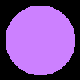

# ray tracer challenge

working with http://raytracerchallenge.com/

all code is written in Ruby by me!

**tools:**

- ruby 3.2.2
- minitest
- standard

## milestones:

### chapter 5!

sphere rendered (without lighting):

### chapters 3 + 4!

Matrix transformations are used to rotate a point around the origin 12 times, like the times on a clock:

### chapters 1 + 2!

using Tuple + Canvas to draw a 2d image simulating a projectile with gravity and a headwind:

