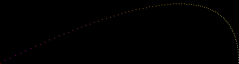

# ray tracer challenge

working with this book: http://raytracerchallenge.com/

the book defines tests that the code should pass, but all implementation is my own.

## tools:

- ruby 3.2.2
- minitest
- rufo

## milestones:

### chapters 1 + 2

tuple, point, vector, color, and canvas come together to create a 2d image!

this image simulates a projectile starting at point (0, 1) with a velocity of 10 \* (2, 1) and a gravity + headwind velocity of (-0.1, -0.1).

