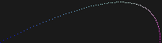

# ray tracer challenge

working with http://raytracerchallenge.com/

all code is written in Ruby by me.

## tools:

- ruby 3.2.2
- minitest
- standard

## milestones:

### chapters 1 + 2

tuple, point, vector, color, and canvas come together to create a 2d image.

this image simulates a projectile starting at point (0, 1) with a velocity of 10 \* (2, 1) and a gravity + headwind velocity of (-0.1, -0.1).

### chapters 3 + 4

matrix transformations are used to rotate a point around the origin 12 times, like the times on a clock.

